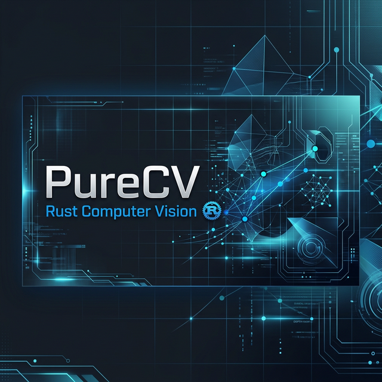

# PureCV



[](https://github.com/webarkit/purecv/actions/workflows/ci.yml)
[](https://github.com/webarkit/purecv/actions/workflows/miri.yml)
[](https://crates.io/crates/purecv)
[](https://crates.io/crates/purecv)
[](https://www.npmjs.com/package/@webarkit/purecv-wasm)
[](https://github.com/webarkit/purecv/stargazers)
[](https://github.com/webarkit/purecv/network/members)

A high-performance, **pure Rust** computer vision library reimplementing the `core`, `imgproc`, `features2d`, `video`, and `calib3d` modules of OpenCV. **PureCV** is built from the ground up to be memory-safe, thread-safe, and highly portable — from desktop and WebAssembly down to `no_std` microcontrollers — without the overhead of C++ FFI.

> This project is currently a **Work in Progress**. While most features across the core, imgproc, features2d, video, and calib3d modules have been implemented, the library is not yet stable, and bugs may occur. We are actively optimizing and expanding the feature set.

## 🎯 Philosophy

Unlike existing wrappers, **PureCV** is a native rewrite. It aims to provide:

* **Zero-FFI:** No complex linking or C++ toolchain requirements.
* **Memory Safety:** Elimination of segmentation faults and buffer overflows via Rust's ownership model.
* **Modern Parallelism:** Native integration with **Rayon** for effortless multi-core processing.
* **Portable SIMD:** Optional SIMD acceleration via [`pulp`](https://crates.io/crates/pulp) — auto-detects x86 SSE/AVX, ARM NEON, and WASM `simd128` at runtime. Zero `#[cfg(target_arch)]`, and the few `unsafe` slice reinterpretations that feed the SIMD kernels are checked for undefined behaviour by [Miri](https://github.com/rust-lang/miri) in CI.
* **Embedded-ready:** Builds under `no_std` + `alloc` for bare-metal targets such as the ESP32 — the `core`, `imgproc`, `calib3d`, and `video` modules run without the standard library ([see below](#no_std--embedded-support)).

## ✨ Features

### `purecv-core`
- **Matrix Operations:** Multi-dimensional `Matrix<T>` with support for common arithmetic (`add`, `subtract`, `multiply`, `divide`) and bitwise logic (`bitwise_and`, `bitwise_or`, `bitwise_xor`, `bitwise_not`). Matrix and scalar variants for all operations. Provides safe raw pointer access via `data_ptr` and `data_ptr_mut`, and OpenCV-compliant deep-copying with `copy_to`.
- **Factory Methods:** Intuitive initialization with `zeros`, `ones`, `eye`, and `diag`.
- **Scalar constructors:** `Matrix::new_with_scalar` (fill all pixels from a `Scalar<T>`), `new_with_scalar_from_size`, and `new_with_scalar_typed_from_size`. `set_to` and `set_to_masked` assign a `Scalar<T>` to every pixel (optionally masked); channels beyond 4 default to `T::default()`.
- **Scalar type:** `Scalar<T>` — a 4-channel value — now supports `Index`/`IndexMut` for channel access, `from_array`/`to_array`, `From<[T;4]>` and `From<T>` conversions, and a `map()` helper for per-channel type transforms. Arithmetic traits: per-channel `Add`/`Sub`; `Mul<T>`/`Mul<Scalar<T>>` for scaling and element-wise multiply; safe `Div<T>`/`Div<Scalar<T>>` (returns zero on divide-by-zero); `checked_div()` returning `Result` for integer types.
- **Vector Types:** N-dimensional vectors via the `VecN` struct (e.g., `Vec2`, `Vec3`, `Vec4`), enabling multi-channel vector math and structural interoperability.
- **Comparison:** `compare`, `compare_scalar`, `min`, `max`, `abs_diff`, `in_range`.
- **Structural:** `flip`, `rotate`, `transpose`, `repeat`, `reshape`, `hconcat`, `vconcat`, `copy_make_border`, `extract_channel`, `insert_channel`.
- **Math:** `sqrt`, `exp`, `log`, `pow`, `magnitude`, `phase`, `cart_to_polar`, `polar_to_cart`, `convert_scale_abs`.
- **Stats:** `sum`, `mean`, `mean_std_dev`, `min_max_loc`, `norm`, `normalize`, `count_non_zero`, `reduce`.
- **Metrics:** `psnr` (Peak Signal-to-Noise Ratio), `mahalanobis` (statistical distance).
- **Linear Algebra:** `gemm`, `dot`, `cross`, `trace`, `determinant`, `invert`, `solve`, `solve_poly`, `solve_quadratic`, `solve_cubic`, `set_identity`.
- **Sorting:** `sort`, `sort_idx` with configurable row/column and ascending/descending flags.
- **Clustering:** `kmeans` with random, k-means++, and user-supplied initialization strategies.
- **Transforms:** `transform` (per-element matrix transformation), `perspective_transform` (projective / homography mapping).
- **Random Number Generation:** `randu` (uniform distribution), `randn` (normal/Gaussian distribution), `set_rng_seed`.
- **Channel Management:** `split`, `merge`, `mix_channels`.
- **Utilities:** `add_weighted`, `check_range`, `absdiff`, `get_tick_count`, `get_tick_frequency`.
- **Logging** (OpenCV-style): a `cv::utils::logging`-compatible facade over the [`log`](https://crates.io/crates/log) crate — a 7-level `LogLevel` with `set_log_level`/`get_log_level`, per-subsystem `tags`, `cv_log_*!` macros, and `cv_bail!`/`cv_err!` log-and-return helpers used throughout `core` to report invalid input (wrong dimensions, channel mismatches, …). Bring your own backend (`env_logger`, `tracing`, …) or call `init_basic_logger()` for quick stdout output.
- **Mathematical Constants:** OpenCV-compatible constants — `CV_PI`, `CV_PI_2`, `CV_2PI`, `CV_PI_4`, `CV_LOG2`, `CV_LN2`, `CV_E`, `CV_LN10`, `CV_SQRT2` — backed by `core::f64::consts` for maximum precision (available under `no_std`).
- **ndarray Interop:** Optional, zero-cost conversions to/from `ndarray::Array3` via the `ndarray` feature flag.
- **SIMD Acceleration** (`simd` feature): Trait-based dispatch via `pulp` for `f32`, `f64`, and `u8` types. Accelerated operations include `add`, `sub`, `mul`, `div`, `min`, `max`, `sqrt`, `dot`, `sum`, `add_weighted`, `convert_scale_abs`, `magnitude`, `simd_row_min_max`, `simd_min_max_col`, `simd_gaussian_5tap_h/v`, and `simd_remap_bilinear_row`/`simd_remap_nearest_row`. Falls back to scalar loops at zero cost when disabled.

### `purecv-imgproc`
- **Color Conversions:** High-performance `cvt_color` supporting RGB, BGR, Gray, RGBA, BGRA and more. Up to **6.6× speedup** with Parallel + SIMD. SIMD-accelerated paths (`simd` feature) use fixed-point integer arithmetic (coefficients 77/150/29 ≈ 0.299/0.587/0.114 × 256) for all `*_to_gray` conversions — portable to x86 SSE/AVX, ARM NEON, and WASM `simd128` via `pulp`.
- **Edge Detection:** `canny`, `sobel`, `scharr`, `laplacian`. Optimized `fast_deriv_3x3` kernel delivers up to **12× speedup** with Parallel. For `f32` inputs, the `pulp`-powered `simd_deriv_3x3_row_f32` interior kernel adds a further **1.5× boost**, reaching **22× total speedup** (28.59 ms → 1.28 ms) with Parallel + SIMD — the highest combined speedup in the project.
- **Filtering:** `blur`, `box_filter`, `gaussian_blur`, `median_blur`, `bilateral_filter`. The bilateral filter achieves **7.1× speedup** with Parallel (1.43 s → 202 ms on 512×512); SIMD provides no additional gain due to the non-vectorizable per-pixel exponential weight computation.
- **Morphology:** `erode`, `dilate`, `morph_op` (supports Rect, Cross, Ellipse kernels) and `get_structuring_element`. Features a **separable SIMD fast-path** for rectangular kernels using `simd_row_min_max` and `simd_min_max_col` for `f32`, `f64`, and `u8`.
- **Pyramids:** `pyr_down`, `pyr_up` (Gaussian 5x5 kernel), and `build_pyramid`. `pyr_down` is fully SIMD-accelerated via `simd_gaussian_5tap_h` and `simd_gaussian_5tap_v`, providing significant speedups for multi-channel images.
- **Thresholding:** `threshold` with all 5 OpenCV-compatible types (`BINARY`, `BINARY_INV`, `TRUNC`, `TOZERO`, `TOZERO_INV`). SIMD-accelerated fast path for `u8`, `f32`, and `f64` via the `SimdElement::simd_threshold()` trait method. Works seamlessly with `parallel` feature for row-level Rayon dispatch.
- **Feature Detection:** `corner_harris`, `corner_min_eigen_val` (Shi-Tomasi), `good_features_to_track`, `corner_sub_pix` refinement, and structure tensor computation via `corner_eigen_vals_and_vecs`. Supports both Harris and Shi-Tomasi responses with non-maximum suppression.
- **Hough Transform:** Standard (`hough_lines`) and Probabilistic (`hough_lines_p`) line detection, plus Hough Circle Transform (`hough_circles`) using internally computed Sobel gradients. Fully parallelized via the `parallel` feature.
- **Resizing:** `resize` function utilizing high-performance bilinear interpolation, fully compatible with `parallel` Rayon multi-threading.
- **Geometric Transformations:** `remap` (with bilinear and nearest-neighbor interpolation) and `warp_perspective` (perspective transformations) fully parallelized and SIMD-accelerated.

### `purecv-features2d`
- **FAST Feature Detector:** Real-time corner detector (`FastFeatureDetector`) supporting Type 5_8, 7_12, and 9_16 neighborhood configurations, plus optional non-maximum suppression.
- **ORB Feature Detector:** Oriented FAST and Rotated BRIEF descriptor extractor (`Orb`) supporting scale pyramids, Harris/FAST scoring, orientation tracking, and 256-bit binary descriptors. Optimized with SIMD fast-paths.
- **Feature Matching:** `BFMatcher` (Brute-Force Matcher) supporting `NORM_L1`, `NORM_L2`, and `NORM_HAMMING` distances, with cross-check validation and k-nearest neighbors (`knn_match`).
- **Drawing Utilities:** `draw_keypoints` and `draw_matches` to easily visualize detected features and feature correspondences.

### `purecv-video`
- **Optical Flow:** Pyramidal Lucas-Kanade optical flow implementation with `calc_optical_flow_pyr_lk` and `build_optical_flow_pyramid`. Includes robust window-based tracking, sub-pixel accuracy, spatial gradient optimization, and iterative refinement.

### `purecv-calib3d`
- **Camera Undistortion:** `init_undistort_rectify_map` to compute lens undistortion and rectification maps.
- **Epipolar Geometry:** `find_fundamental_mat` supporting the normalized 8-Point algorithm and robust RANSAC estimation with Sampson distance.
- **Pose Estimation:** Camera pose estimation using `solve_pnp` (Iterative) and `solve_pnp_ransac`.
- **Homography:** Direct Linear Transformation (DLT) and RANSAC-based `find_homography` for robust planar perspective mapping.
- **Geometry:** `rodrigues` for converting between rotation vectors and 3x3 rotation matrices.
- **Linear Algebra Utilities:** Jacobi SVD, null-space solver, 3x3 matrix helpers, and an LCG RNG.

## 🚀 Getting Started

### Installation

Add the following to your `Cargo.toml`:

```toml
[dependencies]
purecv = "0.6"
```

PureCV's minimum supported Rust version (MSRV) is **1.88**.

### Feature Flags

| Flag | Default | Description |
|------|---------|-------------|
| `std` | ✅ | Standard library support (disable for `no_std` — see below) |
| `parallel` | ✅ | Multi-core parallelism via **Rayon** (implies `std`) |
| `ndarray` | ❌ | Interop with the `ndarray` crate (zero-cost views & ownership transfers) |
| `simd` | ❌ | SIMD acceleration via [`pulp`](https://crates.io/crates/pulp) (x86 SSE/AVX, ARM NEON, WASM `simd128`) — implies `std` |
| `wasm` | ❌ | WebAssembly-specific optimizations |

### `no_std` / embedded support

Build with `--no-default-features` to run on bare-metal targets such as the
ESP32 (`purecv = { version = "0.6", default-features = false }`). Only `core`
and `alloc` are required (an allocator must be provided by the target).

| Module | `no_std` | Notes |
|--------|----------|-------|
| `core` | ✅ | Full support. `get_tick_count`/`get_tick_frequency` and the thread-local RNG (`randu`/`randn`/`rand_shuffle`) require `std`. |
| `imgproc` | ✅ | Scalar fallbacks. `hough_lines_p` requires `std` (uses the thread-local RNG); `hough_lines` works without. |
| `calib3d` | ✅ | Full support (RANSAC uses a self-contained PRNG). |
| `video` | ✅ | Full support. Optical-flow pyramids are heap-heavy — size images for your device's RAM. |
| `features2d` | ❌ | Requires `std` for now. |

`parallel`, `simd`, `fft`, and `ndarray` require `std`; disabling default
features gives the scalar, single-threaded code paths.

```toml
[dependencies]
purecv = { version = "0.6", default-features = false }
```

```rust
#![no_std]
extern crate alloc; // an allocator must be provided by your target

use alloc::vec;
use purecv::core::{add, Matrix};
use purecv::imgproc::gaussian_blur;
use purecv::core::types::{BorderTypes, Size2i};

// core arithmetic, no std
let a = Matrix::<f32>::from_vec(2, 2, 1, vec![1.0, 2.0, 3.0, 4.0]);
let b = Matrix::<f32>::from_vec(2, 2, 1, vec![5.0, 6.0, 7.0, 8.0]);
let sum = add(&a, &b)?;

// imgproc under no_std (scalar fallback)
let blurred = gaussian_blur(&sum, Size2i::new(3, 3), 0.0, 0.0, BorderTypes::Reflect101)?;
```

See [`webarkit/purecv-esp32-examples`](https://github.com/webarkit/purecv-esp32-examples)
for runnable ESP32-S3 demos (matrix arithmetic, Gaussian blur, and `solve_pnp`
camera pose estimation).

To enable the `ndarray` feature:

```toml
[dependencies]
purecv = { version = "0.6", features = ["ndarray"] }
```

To enable SIMD + Parallel for maximum performance:

```toml
[dependencies]
purecv = { version = "0.6", features = ["parallel", "simd"] }
```

### Usage Example

```rust
use purecv::core::{Matrix, Size, Scalar};
use purecv::imgproc::{cvt_color, ColorConversionCodes};

fn main() -> Result<(), Box<dyn std::error::Error>> {
    // Create a 3-channel matrix initialized to ones
    let mat = Matrix::<f32>::ones(480, 640, 3);

    // Create an identity matrix
    let identity = Matrix::<f32>::eye(3, 3, 1);

    // --- Scalar API ---

    // Build a Scalar from individual channels or a single broadcast value
    let blue = Scalar::new(255.0f32, 0.0, 0.0, 0.0);
    let gray = Scalar::all(128.0f32);   // all four channels = 128

    // Index channels directly
    assert_eq!(blue[0], 255.0);

    // Conversions
    let from_arr: Scalar<f32> = [1.0, 2.0, 3.0, 4.0].into();
    let arr = from_arr.to_array();          // → [1.0, 2.0, 3.0, 4.0]

    // Per-channel arithmetic
    let a = Scalar::new(10.0f32, 20.0, 30.0, 40.0);
    let b = Scalar::new(1.0f32,  2.0,  3.0,  4.0);
    let sum   = a + b;                      // per-channel add
    let diff  = a - b;                      // per-channel sub
    let scaled = a * 2.0f32;               // broadcast multiply
    let prod  = a * b;                      // element-wise multiply
    let div   = a / 2.0f32;               // broadcast divide (zero-safe)

    // Map channels to another type
    let as_u8: Scalar<u8> = a.map(|x| x as u8);

    // --- Matrix scalar constructors ---

    // Fill an entire matrix with a constant Scalar value
    let filled = Matrix::<f32>::new_with_scalar(480, 640, 3, blue);

    // Use set_to to overwrite an existing matrix
    let mut mat2 = Matrix::<f32>::zeros(480, 640, 3);
    mat2.set_to(gray);

    println!("Matrix size: {}x{}", mat.cols, mat.rows);
    Ok(())
}
```

### Logging

PureCV mirrors OpenCV's `cv::utils::logging` on top of the [`log`](https://crates.io/crates/log)
facade, so the output backend stays your choice (`env_logger`, `tracing`,
`console_log` on WASM, …). For a quick start, `init_basic_logger()` installs a
simple stdout logger. Internally, `core` logs a warning whenever a function
rejects invalid input:

```rust
use purecv::core::arithm;
use purecv::core::logging::{self, LogLevel};
use purecv::core::Matrix;

fn main() {
    // Install the built-in stdout logger and let warnings through.
    logging::init_basic_logger().ok();
    logging::set_log_level(LogLevel::Warning);

    // Mismatched dimensions -> logs a warning AND returns Err(..)
    let a = Matrix::<f32>::new(4, 4, 3);
    let b = Matrix::<f32>::new(2, 2, 1);
    let _ = arithm::add(&a, &b);
    // [WARN] purecv::core - add: matrices must have the same dimensions (src1 4×4×3, src2 2×2×1)
}
```

You can also emit your own messages with the `cv_log_*!` macros and filter per
subsystem via the standard `RUST_LOG` syntax (e.g. `RUST_LOG=purecv::core=warn`):

```rust
use purecv::core::logging::tags;
purecv::cv_log_info!(tags::IMGPROC, "gaussian blur, ksize = {}", 5);
```

### ndarray Interoperability

With the `ndarray` feature enabled, you can convert between `Matrix<T>` and `ndarray::Array3<T>`:

```rust
use purecv::core::Matrix;

// Matrix → ndarray (zero-cost view)
let mat = Matrix::<f32>::ones(480, 640, 3);
let view = mat.as_ndarray_view(); // ArrayView3<f32>, shape (480, 640, 3)

// Matrix → ndarray (ownership transfer)
let mat2 = Matrix::<f32>::ones(480, 640, 3);
let arr = mat2.into_ndarray();

// ndarray → Matrix (guarantees contiguous C-order layout for SIMD/WASM)
let mat3 = Matrix::from_ndarray(arr);

// Also works via the From trait
let arr2 = ndarray::Array3::<f32>::zeros((100, 100, 3));
let mat4: Matrix<f32> = Matrix::from(arr2);
```

### WASM Package for Browsers & Node.js

PureCV provides a compiled WebAssembly package via `wasm-bindgen` enabling access to core matrix operations, thresholds, filters, and derivatives directly from JavaScript/TypeScript.

This includes both a **standard build** for maximum compatibility and a **SIMD-optimized build** for massive performance gains in modern browsers.

```bash
npm install @webarkit/purecv-wasm
```

See the [WebAssembly documentation](crates/wasm/README.md) for more usage examples and API details.

### Running Examples

Explore the capabilities of PureCV by running the provided examples:

```bash
# Basic matrix arithmetic
cargo run --example arithmetic

# Vector types and multi-channel operations
cargo run --example vecn_ops

# Structural operations (flip, rotate, split/merge)
cargo run --example structural_ops

# Color conversion (RGB to Grayscale)
cargo run --example color_conversion

# Lookup Table (LUT) transformations
cargo run --example lut_example

# Thresholding — all 5 types
cargo run --example threshold

# Image filters (blur, gaussian, canny, sobel, …)
cargo run --example filters

# Morphological operations (erode, dilate, morph_op)
cargo run --example morphology

# Gaussian pyramids (pyr_down, pyr_up)
cargo run --example pyramids

# Hough Transform (Lines and Circles detection)
cargo run --example hough_transform

# Corner Detection (Harris, Shi-Tomasi, Sub-pixel refinement)
cargo run --example corner_detection

# FAST keypoint corner detection (with drawing output)
cargo run --example fast_features

# ORB keypoint detection and Rotated BRIEF descriptor extraction
cargo run --example orb_features

# Feature matching (Brute-Force matching with ORB descriptors)
cargo run --example match_features

# Discrete Fourier Transform (DFT)
cargo run --example dft_example

# Optical Flow (Pyramidal Lucas-Kanade)
cargo run --example optical_flow
cargo run --example optical_flow_video

# Pose Estimation (solve_pnp and rodrigues)
cargo run --example pose_estimation

# Camera Undistortion and Perspective Warping
cargo run --example rectification
```

## 🧪 Testing & Benchmarking

### Running Tests
PureCV uses a comprehensive suite of unit tests to ensure correctness and parity with OpenCV. The test suite currently includes **308 unit tests** (plus **40 doc-tests**) covering:

- **Core module:** Matrix factories, scalar arithmetic variants, bitwise scalar ops, min/max, comparison ops (`compare`, `in_range`), reduction (`reduce`, `count_non_zero`), polar/cartesian conversions, linear algebra (`determinant`, `invert`, `solve`), channel ops (`extract_channel`, `insert_channel`), `DynamicMatrix`, transforms, sorting, clustering, and RNG.
- **Imgproc module:** Filters, derivatives, edge detection, color conversions (including gray-to-RGB/BGR/RGBA/BGRA), thresholding, morphology (`erode`, `dilate`), pyramids (`pyr_down`, `pyr_up`), and kernel helpers (`get_gaussian_kernel`, `get_sobel_kernels`).
- **Features2d module:** Keypoint structures (`KeyPoint`), FAST corner detection (`FastFeatureDetector`), scale pyramids, and ORB feature extraction & BRIEF descriptor extraction (`Orb`).
- **Video module:** Tracking and optical flow capabilities including `calc_optical_flow_pyr_lk` and `build_optical_flow_pyramid` implementations.
- **Calib3d module:** SVD, homography estimation, pose estimation (`solve_pnp`), and `rodrigues`.

```bash
# Run all tests
cargo test
```

### Running Benchmarks
Performance is a core focus. Benchmarks are available for `arithm`, `imgproc`, and `structural` modules across four configurations:

```bash
# Standard (sequential, no SIMD)
cargo bench --no-default-features

# SIMD Only (sequential + auto-vectorization)
RUSTFLAGS="-C target-cpu=native" cargo bench --no-default-features

# Parallel (Rayon multi-threading)
cargo bench --features parallel

# Parallel + SIMD (maximum throughput)
RUSTFLAGS="-C target-cpu=native" cargo bench --features parallel
```

#### Key Performance Highlights (1024×1024 matrices, *updated 2026-03-17*)

| Operation | Standard | Parallel + SIMD | Speedup |
|-----------|----------|-----------------|---------|
| `cvt_color_rgb2gray` | 2.66 ms | **404 µs** | 6.6× |
| `sobel_3x3` (generic) | 22.79 ms | **1.87 ms** | 12× |
| `sobel_3x3_f32_dx` ★ | 28.59 ms | **1.28 ms** | **22×** |
| `sobel_3x3_f32_dy` ★ | 26.24 ms | **1.27 ms** | **21×** |
| `bilateral_filter` (512×512) | 1.43 s | **202 ms** | 7.1× |
| `laplacian_3x3` | 45.91 ms | **4.44 ms** | 10.4× |
| `dot` | 997 µs | **157 µs** | 6.4× |
| `gemm_256×256` | 15.71 ms | **4.40 ms** | 3.7× |
| `canny` | 57.61 ms | **12.54 ms** | 4.6× |
| `fast_detect` (512×512) | 2.04 ms | **499 µs** | 4.1× |
| `orb_detect` (512×512) | 117.4 ms | **30.7 ms** | 3.9× |
| `calc_optical_flow_pyr_lk` (512×512, 49 pts) | 27.5 ms | **-** | - |

> ★ Uses non-zero sinusoidal data to exercise the `simd_deriv_3x3_row_f32` SIMD kernel. Best combined speedup in the project.
>
> Full results in [`benches/benchmark_results.md`](./benches/benchmark_results.md)

## 🗺 Roadmap

- [x] [**Milestone 7: Geometric Rectification & Calibration**](https://github.com/webarkit/purecv/milestone/7) - Expand purecv to support camera intrinsic correction and geometric transformation, essential for robust 3D pose estimation and AR surface tracking.
- [x] **Embedded / `no_std` support** - The `core`, `imgproc`, `calib3d`, and `video` modules compile without the standard library for microcontrollers such as the ESP32. See [`purecv-esp32-examples`](https://github.com/webarkit/purecv-esp32-examples).

## 📄 License

This project is licensed under the LGPL-3.0 License.
